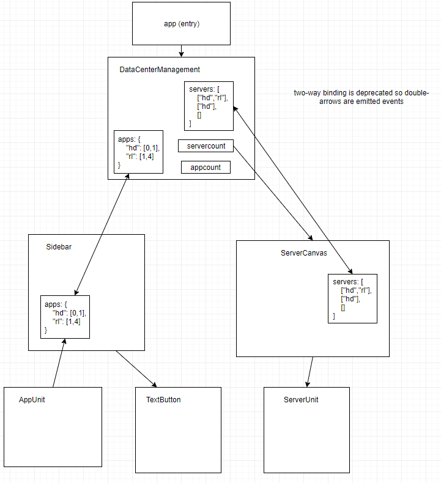

# Mesosphere DC/OS Frontend Challenge
_For the purpose of this challenge, I have selected to use Vue.js and LocalStorage._


### Functional Requirements
- Start with 4 servers.
- Add server.
- Delete server and move its applications to available servers or no server.
- Add application to next available server or no server.
- Delete most recent application from server.
- **[Extra]** Update "Added X min ago" every minute, 1 h in 60 min.

---

### Project setup
```
npm install
```

#### Compiles and hot-reloads for development
```
npm run serve
```

#### Compiles and minifies for production
```
npm run build
```

#### Lints and fixes files
```
npm run lint
```

---

### Approach
Since the design seems to be rendering similar code, this is a great opportunity to utilize components (React or Vue)! Because of time constraint, might end up using Vue.



#### View
- Application: To house this application/the background.
- Data Center Manager Component: The "page" component, consists of a Sidebar component and a Server Canvas component. Has a set width/not reactive (for now).
- "Sidebar" Control Component: Contains Application components and the control for adding/removing servers. Use state to control Server Canvas.
- "Server Canvas" Component: Will grid out and contain the Server Components. Default value of 4.
- "Server" Component: using Applications as state, having an object to represent applications on the server. Have a max applications prop for configurability.
- "Application" Component: Pass in Application name and color as props i.e. Hadoop, Rails, Chronos, Storm, Spark, make up the control components on the left.

#### Model
- Referencial Integrity on application and servers data structure. If I can get this I can just delete a server or delete an application.
- Storing all applications and which servers they are on: makes adding and removing applications easier, each entry should look like: `[1234] => {"serverId": 3456, "timeAdded": Date.now() /*for the "Added X minutes ago" display*/}`.
  - Track last added Application type (via Stack). : Whenever user clicks any off the application add button, layer will add to stack. + and - will add/remove from stack, server will also need to know what application is installed on it, have server query this "stack" first to see if applications to server changed. Thinking about an array of stacks.
- Storing servers and which applications are on server: for server to render application image, each entry should look like: `[3456] => {"applicationIds": [1234,2345]}`
- Store in Local store? Will solve persistence and since value is "global" will be easier to maintain state and serve functions for this application context.
- To remove I just need to know which server to delete app from, which would change the style of the server if next app is not the same.
- LocalStorage is ApplicationNames mapped to a stack of serverIds. i.e. `{"Hadoop": [1,2,5], "Spark": [3,4], "Storm": [2,5]}` and servers `[[], ["Hadoop"]]`
- SQLite on the browser?

### Nice-to-haves
- I want to utilize HTML5 semantics for acessability.
- I want to make it responsive with flexbox.
- Popups/Alerts when can't add anymore applications.
- Selection of server to add applications to or remove applications from.
- Paged server display.
- Pagination
- Disabled plus over Available Apps when no more servers, on hover will show tooltip saying there are no more available servers.
- Data persistence: Not important but makes sense for a mock service to have persisted data.

### Disclaimers
- Space-arround on the server canvas makes adding it weird.
- Server canvas title should stay up.
- Some yellow flags I potentially see are the redundancy of passing up data.
- This is **NOT RESPONSIVE**, so a minimum screen width of 1300px is required for good visual experience. This is an easy fix though.
